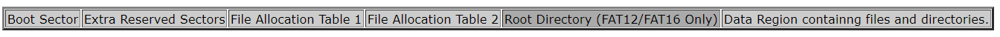
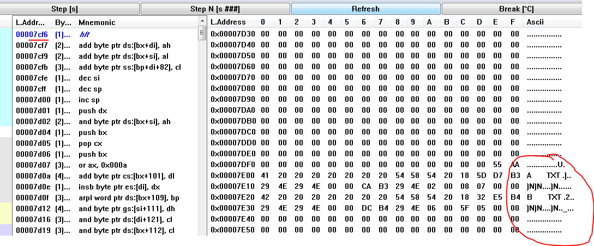

# My Programming and Debug information

## 2019-01-09

- Load **Root Directory** from a FAT12/16 formatted floppy disk
- `copy a.txt A:\`
- `copy b.txt A:\`
- Then the floppy disk A: has two normal files, a.txt and b.txt
- Don't forget the Boot1.bin is at the **Boot Sector**
- The FAT12/16 formated disk sectors are:

- Open bochs debugger, enter `lb 0x7cf6`, enter `c`
- Click *F7* and enter *0x7c00* to dump memory at 0x7c00
- Now you can see the a.txt and b.txt **Root Sector** at the 0x7e00 address

