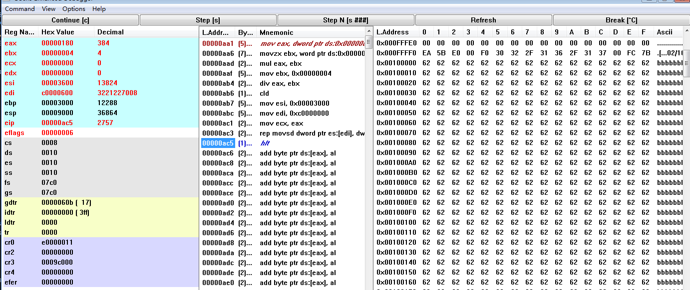

# MyOS versions

The things that version did.

## MyOS v0.0.0

- See readme.md to install and configurate all the softwares.

## MyOS v0.0.4

### In Stage1 Directory

- `nasm Boot1.asm -o Boot1.bin`
- `partcopy Boot1.bin 0 200 -f0`

### In Stage2 Directory

- `nasm Stage2.asm -o KRNLDR.SYS`
- `copy /Y KRNLDR.SYS  A:\`

### Bochs

- start bochsdbg.exe
- `lb 0x0500`
- The KRNLDR.SYS file is loaded by Boot1.bin to 0050:0000 address
- At the end of *Boot1.bin*, it *retf* to 0050:0000 address to execute

## MyOS v0.0.5

### Changes

- Use `%include` to include other files
- Enable A20
- Load GDT(Global Discriptor Table) which defines what memory can be executed (the **Code Descriptor**), and what memory contains data (**Data Descriptor**)
- GDT item is 64 bits (8 Bytes)

### Bochs

- After InstallDGT, we can click *view-->GDT* to see the GDT

## MyOS v0.0.6

### Changes

- Check physical memory size: BiosGetMemorySize64MB in Memory.inc

### Bochs debug

- `lb 0x06f8`: before hlt, after 0x0500
- *eax* register contains the total size of the physical memory (bochs default: 32M, see Bochs-2.6.9/bochsrc-sample.txt line-340)

### References

- multiboot_info, BiosGetMemorySize64MB <http://www.brokenthorn.com/Resources/OSDev17.html>

## MyOS v0.0.7

### Changes

- Load another file(B.TXT) from floppy disk into memory 0x3000 by Stage2.asm->KRNLDR.SYS

### Bochs debug

- In Stage2 Directory: `nasm Stage2.asm -o KRNLDR.SYS`
- In Stage2 Directory: `copy /Y KRNLDR.SYS  A:\`
- In Stage2 Directory: `copy /Y a.txt  A:\`
- In Stage2 Directory: `copy /Y b.txt  A:\`
- Bochs: `lb 0x0500`
- Go to the last *hlt* command
- Click *F7* and enter `0x3000`
- *ECX* contains the file size in sectors
- Change the value of 'ImageName' in common.inc can load different files into 0x3000

## MyOS v0.0.8

At staring, the BIOS set the address space into some regions. Each region define something. This is called Memory-mapping.

The BIOS also set each devices (register in devices) a number, which is called port number. When we use `in` or `out` instrunctions, we communicate with these devivces. This is called Port-mapped I/O.

### Changes

- Enter protected mode. Now we will use descriptor:address to addressing. The descriptor (also called selector) is in GDT. We now installed 3 descriptors: NULL_DESC(0x00), CODE_DESC(0x08), DATA_DESC(0x10), which offset is relative to GDTR register.
- Use `jmp CODE_DESC:Stage3` to far jump to Stage3. This instruction will set CS register to CODE_DESC descriptor. We now set the CODE_DESC's base address is 0x0000, so we can jump to Stage3. If we set CODE_DESC's base low address to 1, this instruction will jump to Stage3's next instruction. You can try it by yourself.
- Clear screen

### Bochs debug

- Look 0xB8000 liner memory dump. At the Bochs start, it's all *FF*. When some characters were print on screen, we can see this dump has the same character.
- `lb 0x0500`, *F7* and enter `0xB8000`, we can see the same character:

- After we clear the screen, this is also changed.

### References

- [jmp instruction](https://c9x.me/x86/html/file_module_x86_id_147.html)
- [Memory Map (X86)](https://wiki.osdev.org/Memory_Map_(x86))
- [I/O Ports](https://wiki.osdev.org/I/O_Ports)
- [Bochs I/O ports](http://bochs.sourceforge.net/techspec/PORTS.LST)

## MyOS v0.0.9

Paging.

Set **CR0** register's 31 bit to 1 will enable paging, and use **CR3** as Page Directory Base Register(PDBR) which stores the base address of Page Directory.

When use paging addressing, the virtual address format is: `directory index(10 bits) + page table index(10 bit) + offset into page(12 bits)`.

The `directory index` looks the *Page Directory* in Page Directory Table. The `page table index` looks the *Page Entry* in Page Table. These two changes the virtual address to a physicall address. Then add the `offset into page` to find the real address.

*Page Diercotry* and *Page Entry* are both 32-bits(4-Bytes) length. So the total Page Directory table's size is 4KB, and each Page Table's size is 4KB.

*Page Directory* is also called *Page Directory Table Entry*, or **PDE**. PDE's right-most 12-bits determines it's Page Table's privaledeg. PDE's other bits denotes the Page Table's physicall address. For example, one PDE is *0000 0000 0000 1001 1110-0000 0000 0000* or *0x0009-E000*, no matter what the left-most 12-bits are, this PDE points to a Page Table at physicall address 0x0009-E000.

*Page Entry* is alse called *Page Table Entry*, or **PTE**. PTE's format is farmilar with the PDE's. For example, one PTE is *0000 0000 0001 0000 0000-0000 0000 0000* or *0x0010-0000*, no matter what the left-most 12-bits are, this PTE points to a physicall address 0x0010-0000(1M).

In our MyOS's *Paging.inc* file, we set the 768th PDE point a Page Table whose address at 0x0009-E000. And the 0th PTE in this table points to physicall address 0x0010-0000. So, when we want to access virtual address *0xC000-0000*(3G), or *1100 0000 00-00 0000 0000-0000 0000 0000*, the left-most 10-bits determines we will find the 768th PDE, the middle 10-bits determines we will find the 0th PTE. The PDE's value is 0x0009-E00**7**, we known the Page Table is at physicall address 0x0009-E000. When we find this PTE, it's value is 0x0010-000**7**, which means the physicall address is 0x0010-0000. (The PDE or PTE's right-most 12-bits is privaledge value, not address value)

The *Page Directory Table* and all the *Page Table* are 4KB aligned

### Changes

- Enable paging.

### Bochs debug

- `lb 0x0500`, `c`
- Double click the last instruction hlt. `c`
- Click *view->PageTable*, we can see the PageTable:

## MyOS v0.0.10

Copy from pyhsical address 0x3000 to 0x10-0000. In our paging settings, virtual address 0x3000 is mapped to physical address 0x3000, and virtual address 0xC000-0000 is mapped to physical address 0x10-0000. See *PageTable* in Bochs.

### Bochs debug

- Stop at Stage2.asm#CopyImage, and check the value at physical address 0x3000:

- Check the GDT:

- Check the PageTable:

- At last intruction hlt, the value at physical address 0x10-0000 (or liner address 0xc000-0000) is the same as 0x3000:

## MyOS v0.0.11

Test file ImageName(Now is B.TXT).

### Changes

- Compare file ImageName's 60th byte with 'PE'
- We set B.TXT's 60, 61, 62, 63th bytes to 0x00000001. This is because the Stage2.asm#TestImage's cmpsw instruction will compare DS:SI with ES:DI, so we set B.TXT for setting ESI to 0xC000-0001.

### Bochs debug

- `copy /Y b.txt A:\`
- run

- If we set B.TXT's 1, 2th bytes to 'PE', it will not print this wrong infomation. Out program will think this file is a PE file. You can test it.

## MyOS v0.0.12

Execute kernel.

### Changes

- After the PE file was loaded to virtual address 0xC000-0000 (physical address 0x10-0000), we will execute the file by checking it's [PE format](http://www.4hou.com/system/7782.html).

### MS VC++ SetUp

- *File* --> *New* --> *Project*, chose *Empty Project*
- One *Solution* can contain more than one *Project*.
- Create *Kernel* and *Lib* **empty project** in one *Solution*. Create some *.cpp* file.
- In the *Solution Explorer*, right click on one *Kernel*, click *Properties*.
  - General --> Configuration Type: **Application(.exe)**
  - C/C++ --> General --> Debug Information Format: *Set to empty*
  - C/C++ --> General --> Warning Level: /Wall
  - C/C++ --> Preprocessor --> Preprocessor Definitions: **ARCH_X86**
  - C/C++ --> Preprocessor --> Ignore Standard Include Path: Yes (/Y)
  - C/C++ --> Code Generation --> Enable C++ Exceptions: No
  - C/C++ --> Code Generation --> Struct Member Alignment: 1 Byte (/Zp1)
  - C/C++ --> Code Generation --> Buffer Security Check: No (/GS-)
  - C/C++ --> Language --> Enable Run-Time Type Info: No (/GR-)
  - The linker produces a linker map with all of these symbolic names.
  - Linker --> General --> Output File: A:\KRNL32.EXE (For quick test)
  - Linker --> Input --> Additional Dependencies: Set to empty.
  - Linker --> Input --> Ignore All Default Libraries: Yes (/NODEFAULTLIB)
  - Linker --> Debugging --> Generate Map File: Yes (/MAP)
  - Linker --> Debugging --> Map File Name: Kernel.map
  - Linker --> System --> SubSystem: Native (/SUBSYSTEM:NATIVE)
  - Linker --> System --> Driver: Driver (/DRIVER)
  - Linker --> Optimization --> Refrences: Yes (reduce kernel size)
  - Linker --> Optimization --> Enable COMDAT folding: Yes (reduce kernel size)
  - Linker --> Advanced --> Entry Point: kernel_entry
  - Linker --> Advanced --> Base Address: 0x100000
  - Linker --> Advanced --> Fixed Base Address: No
  - Linker --> Command Line --> Additional options: /ALIGN:512
- In the *Solution Explorer*, right click on one *Lib*, click *Properties*.