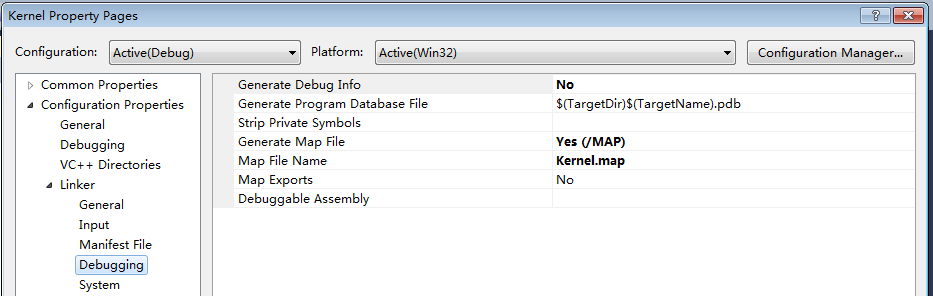

# How to set a new SysCore solution

- *File* --> *New* --> *Project*, chose *Empty Project*. The *Solution Name* is `SysCore`. The *Name* is `Kernel`


- In the *Solution Explorer*, right click the *Solution 'SysCore'* line, click *Add* --> *New Project*, add an empty project `Lib`


- In the *Kernel* project, add *main.cpp* and *entry.cpp* files
- In the *Lib* project, add *cstd.cpp* file

- Right click *Kernel* --> *Properties*, click *Common properties* --> *Add New Reference*, choose *Lib* and click *OK*


- *Kernel Property Pages* --> *Configuration Properties* --> C/C++
  - C/C++ --> General --> Debug Information Format: (/Zi)
  - C/C++ --> General --> Warning Level: /Wall
  - C/C++ --> Optimization --> Optimization: (/O2)
  - C/C++ --> Optimization --> Omit Frame Pointers: Yes (/Oy)
  - C/C++ --> Preprocessor --> Preprocessor Definitions: **ARCH_X86**
  - C/C++ --> Preprocessor --> Ignore Standard Include Path: Yes (/Y)
  - C/C++ --> Code Generation --> Enable Minimal Rebuild: No (/Gm-)
  - C/C++ --> Code Generation --> Enable C++ Exceptions: No
  - C/C++ --> Code Generation --> Basic Runtime Checks: *Set to empty*
  - C/C++ --> Code Generation --> Runtime Library: *Set to empty*
  - C/C++ --> Code Generation --> Struct Member Alignment: 1 Byte (/Zp1)
  - C/C++ --> Code Generation --> Buffer Security Check: No (/GS-)
  - C/C++ --> Language --> Enable Run-Time Type Info: No (/GR-)
  - C/C++ --> Output Files --> Assembler Output: (/FAs)
  - It's Command Line:

  ```text
  /Zi /nologo /Wall /WX- /O2 /Oy /D "ARCH_X86" /X /Gm- /Zp1 /GS- /fp:precise /Zc:wchar_t /Zc:forScope /GR- /Fp"Debug\Kernel.pch" /FAs /Fa"Debug\" /Fo"Debug\" /Fd"Debug\vc100.pdb" /Gd /analyze- /errorReport:queue
  ```

- *Kernel Property Pages* --> *Configuration Properties* --> Linker
  - Linker --> General --> Output File: A:\KRNL32.EXE (For quick test)

  

  - Linker --> Input --> Additional Dependencies: Set to empty.
  - Linker --> Input --> Ignore All Default Libraries: Yes (/NODEFAULTLIB)

  
  
  
  - Linker --> Debugging --> Generate Map File: Yes (/MAP)
  - Linker --> Debugging --> Map File Name: Kernel.map
  
  
  
  - Linker --> System --> SubSystem: Native (/SUBSYSTEM:NATIVE)
  - Linker --> System --> Driver: Driver (/DRIVER)
  
  
  
  - Linker --> Optimization --> Refrences: Yes (reduce kernel size)
  - Linker --> Optimization --> Enable COMDAT folding: Yes (reduce kernel size)
  
  
  
  - Linker --> Advanced --> Entry Point: kernel_entry
  - Linker --> Advanced --> Base Address: 0x100000
  - Linker --> Advanced --> Fixed Base Address: No
  
  
  
  - Linker --> Command Line --> Additional options: /ALIGN:512
  - It's Command Line:

  ``` text
  /OUT:"A:\KRNL32.EXE" /INCREMENTAL:NO /NOLOGO "H:\SysCore\Debug\Lib.lib" /NODEFAULTLIB /MANIFEST:NO /ManifestFile:"Debug\Kernel.exe.intermediate.manifest" /ALLOWISOLATION /MANIFESTUAC:"level='asInvoker' uiAccess='false'" /PDB:"H:\SysCore\Debug\Kernel.pdb" /MAP":Kernel.map" /SUBSYSTEM:NATIVE /Driver /OPT:REF /OPT:ICF /PGD:"H:\SysCore\Debug\Kernel.pgd" /TLBID:1 /ENTRY:"kernel_entry" /BASE:"0x100000" /FIXED:NO /MACHINE:X86 /ERRORREPORT:QUEUE /ALIGN:512
  ```

- Right click *Lib* --> *Properties*, click *General*, change *Configuration Type* to **Static Library (.lib)**.


- *Lib Property Pages* --> *Configuration Properties* --> C/C++ --> Command Line:

``` text
/Zi /nologo /W1 /WX- /O2 /Oy- /D "ARCH_X86" /Gm- /EHsc /GS /fp:precise /Zc:wchar_t /Zc:forScope /Fp"Debug\Lib.pch" /Fa"Debug\" /Fo"Debug\" /Fd"Debug\vc100.pdb" /Gd /analyze- /errorReport:queue 
```