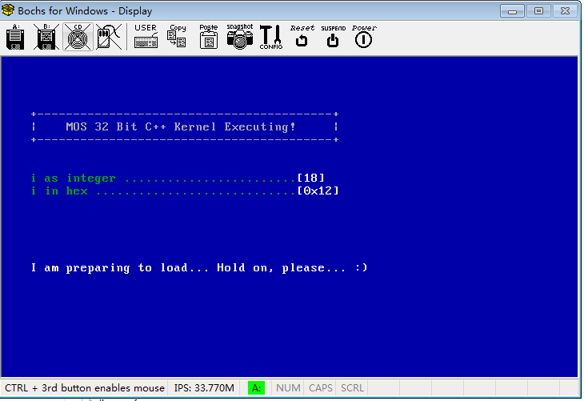
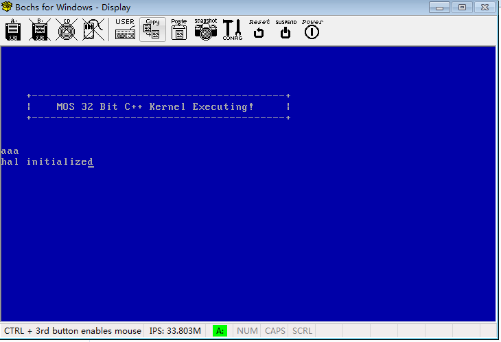

# VC++ SysCore Versions

The [02-versions.md](./02-versions.md) contains all the GRUB like versions. Now we will step into the real kernel.

## MyOS v0.0.13

### Changes

- Setup the VC++ 2010 environment.
- Add Kernel, Lib, Include, Hal projects.
- Kernel is the start project.
- Lib#cstd.cpp is a C++ runtime environmnet. Because the MyOS has no C++ runtime environment, so we build one. This simple runtime is only include some simple functions.
- Lib#string.cpp is a String Operation library.
- Include only contains .h files, so it can be a *Utility* Type.
- Hal contains the hardware operations. It contains some function to communicate with hardware according **port mapping**.
- Kernel is the real kernel of our MyOS.
- Kernel#entry.cpp is the entry point. It has a function *kernel_entry*, which is the exact name we set on the *Linker's entry point* of Kernel's property pages.
- Kernel#main.cpp is our *main* function which is called by entry.cpp.
- Kernel#DebugDisplay.cpp contains some useful functions to display strings on the screen.

### Bochs debug

- Comment the  *bochsrc.bxrx*'s line: `# display_library: win32, options="gui_debug" # use Win32 debugger gui`, disable the GUI debug.
- Click the *bochs.exe* to start.

## MyOS v0.0.14

### 1. Changes

#### 1.1 GDT

- Hal#gdt.h contains functions and structures about GDT(Gloable Descriptor Table), which is used to define the memory usage in the Virtual Addressing Space. In our example, the gdt.cpp#i86_gdt_initialize() initialize 5 GDT items:

| index | selector | base address | size       | DPL | info        |
|-------|----------|--------------|------------|-----|-------------|
| 0     | 0x0000   | 0            | 0          | 0   | Unused      |
| 1     | 0x0008   | 0            | 0xFFFFFFFF | 0   | 32-bit code |
| 2     | 0x0010   | 0            | 0xFFFFFFFF | 0   | 32-bit data |
| 3     | 0x0018   | 0            | 0xFFFFFFFF | 3   | 32-bit code |
| 4     | 0x0020   | 0            | 0xFFFFFFFF | 3   | 32-bit data |

- In our gdt example, we can use all the space as code or data memory field. GDT's base address is stored by `lgdt` Ring 0 instruction.

#### 1.2 IDT

- Hal#idt.h contains functions and structures about IDT(Interrupt Descriptor Table), which is used to store the Interruptions used by System. In real mode, this table is also called IVT(Interrupt Vector Table). When a hardware or software calls an interrupt, the CPU will find the IDT to deal with this interrupt.
- In our example, we installed 256 IRs in the IDT. All of them has a default handler which does nothing. IDT's base address is stored by `lidt` Ring 0 instruction.

#### 1.3 CPU

- Hal#regs.h contains the CPU register's structure.
- Hal#cpu.h and cpu.cpp contains some functions associated with CPU. The most important is the *i86_cpu_initialize()* function, which called GDT's and IDT's initialize function to install GDT and IDT in protected mode.

### 2. Bochs

